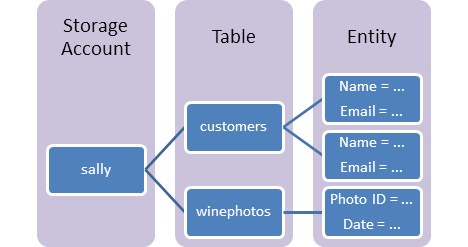
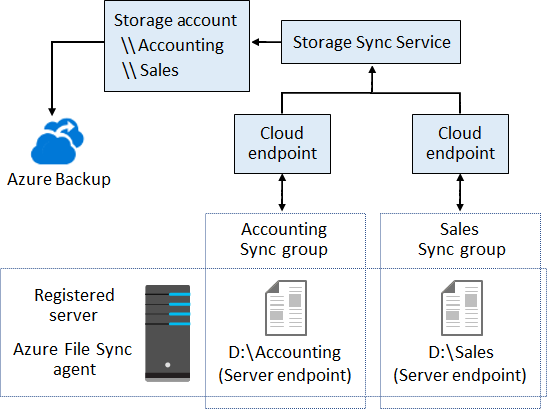
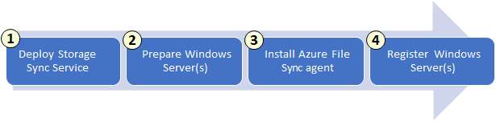

# Implement and manage storage in Azure

## Configure storage accounts

- Azure Storage
- Supports three categories of data:
  1. Structured data
  1. Unstructured data
  1. Virtual machine data
- Storage account
- Storage account tiers
  - Standard
    - Backed by hard disk drives (HDD)
    - Lowest cost per GB
    - Useful for bulk storage or infrequently accessed data
  - Premium
    - Solid state drives (SSD)
    - Lowest latency performance
    - Useful for frequently accessed data
  - Cannot convert tiers! (requires creating new storage account)
- Storage services
  - Blob storage
    - Blob containers
    - Unstructured data
    - Accessible over HTTP and HTTPS
    - Blob types:

      | Type | Usage |
      | --- | --- |
      | Block blobs | Most scenarios |
      | Append blobs | Scenarios where data is added to files over time |
      | Page blobs | Scenarios that require storing index-based and sparse data structures (operating systems, virtual machine data disk, databases etc.) |

      - After you create a blob, you can't change its type
    - Common use cases:
      - Storing documents, images, audio, video etc.
      - Backup and restore, disaster recovery, archiving etc.
  - File storage
    - Network file shares
    - Accessible over Server Message Block (SMB) (port 445) and Network File System (NFS) protocols
      - SMB for standard and premium tiers, NFS for premium only
    - Common use cases:
      - Easy migration from on-prem to cloud for applications that rely of file shares
      - Share data, tools and configuration files between multiple virtual machines
      - Store diagnostic logs, metrics and crash dumps for later processing or analyzing
  - Queue storage
    - Message queues
    - Asynchronous processing (i.e. messages are queued then processed one at a time)
    - Common use cases:
      - Create backlog of work to process
  - Table storage
    - Non-relational structured data (aka. NoSQL data)

      

    - Common use cases:
      - Customer data
      - Product data
- Storage account types:

  | Type | Services | Usage |
  | --- | --- | --- |
  | Standard general-purpose v2 (GPv2) | Blob storage (including Data Lake storage), File storage, Queue storage, Table storage | Most scenarios |
  | Premium block blobs | Blob storage | Scenarios that require low latency performance |
  | Premium file shares | File storage | Scenarios that require both SMB and NFS file shares |
  | Premium page blobs | Blob storage (page blobs only) | Scenarios that require random read/write storage (operating systems, virtual machine data disks, databases etc.) |

- Replication
  - Locally redundant storage (LRS)
    - Three replicas within same data center in primary region
    - All replicas in separate fault and upgrade domains
    - Lowest cost
  - Zone redundant storage (ZRS)
    - Three replicas in separate data centers in primary region
  - Geo-redundant storage (GRS)
    - Replica in secondary region
    - LRS in both primary and secondary regions
    - Read-access geo-redundant storage (RA-GRS)
      - Read access to replica in secondary region
  - Geo-zone redundant storage (GZRS)
    - ZRS + GRS
    - Three replicas in separate data centers in primary region
    - Replica in secondary region
    - LRS in secondary region
    - Read-access geo-zone redundant storage (RA-GZRS)
      - Read access to replica in secondary region
- Default endpoints:

  | Service | Endpoint |
  | --- | --- |
  | Blob service | `<storage_account_name>.blob.core.windows.net` |
  | File service | `<storage_account_name>.file.core.windows.net` |
  | Queue service | `<storage_account_name>.queue.core.windows.net` |
  | Table service | `<storage_account_name>.table.core.windows.net` |

  > **Note**
  >
  > All Azure resources that are provided with an endpoint must have globally unique names.
  > This is to ensure that the endpoint is also globally unique.

- Custom domains
- Secure endpoints using firewall
- Automation
  - Azure CLI
  - Azure PowerShell
  - ARM / Bicep templates
  - SDKs (.NET, Python, Go, etc.)

## Configure Azure Blob Storage

- A blob must be stored in a container
  - A container can store an unlimited number of blobs
  - An Azure storage account can contain an unlimited number of containers
  - You can create the container in the Azure portal
  - You upload blobs into a container
- Blob Storage can store any type of text or binary data
  - text documents
  - images
  - video files
  - application installers.
- Blob Storage uses three resources to store and manage your data
  - An Azure storage account
  - Containers in an Azure storage account
  - Blobs in a container
- Blob storage container name must be unique within the Azure storage account
  - The name can contain only lowercase letters, numbers, and hyphens
  - The name must begin with a letter or a number
  - The minimum length for the name is three characters
  - The maximum length for the name is 63 characters
- Container public access levels
  - Private: No anonymous access
  - Blob: Anonymous read access for blobs
  - Container: Anonymous read and list access for container
- Blob access tiers:
  - Hot: higher storage costs, lower access and transaction costs
  - Cool: lower storage costs, higher access and transaction costs
  - Archive: lowest storage costs, highest access and transaction costs
  - Configured at Storage account level
- Lifecycle management
  - Automatically delete blobs (or versions)
  - Automatically change blob access tier
- Object replication
  - Blob versioning must be enabled
  - Supported for Hot and Cool tier (source and destination may be in different tiers)
  - Reduce latency: replicate data to multiple regions to reduce latency in read operations
  - Distribution: process data in one location, replicate results to many regions
  - Does not support snapshots
- What affects Blob storage pricing?
  - Storage account tier
  - Blob access tier
    - Changes to Storage access tier
      - Cool --> Hot: cost equal to reading all the data existing in the Storage account
      - Hot --> Cool: cost equal to writing all the data into the Cool tier
  - Transactions
  - Geo-replication
  - Data transferred out of Azure region

## Configure Azure Storage security

- Encryption
  - Transit: HTTPS
  - Storage:
    - Microsoft-managed keys
    - Customer-managed keys (CMKs)
- Authentication (authN)
  - Azure AD authN for both config and data plane
- Authorization (authZ)
  - Shared access keys
  - Shared access signatures (SAS)
    - Uniform resource identifier (URI) that grants granular access rights to Storage account or services
    - Cryptographic signature generated using shared access key
    - Downside of SAS (and access key): anyone with SAS (or key) can access Storage account
      - Solution: regenerate access key
  - Azure AD (using RBAC)
  - For security, Azure AD >= SAS > shared access keys
  - Anonymous access

## Configure Azure Files and Azure Files Sync

- Azure Files
  - Fully managed file shares in the cloud
  - Stores data as true directory objects in file shares
  - Provides shared access to files across multiple VMs (cloud or on-prem)
  - Provides shared access to files across operating systems (Windows, Linux or macOS)
- File Share snapshot
  - Point-in-time readonly copy of File Share data
- Azure Files Sync
  - Cache Azure Files shares on on-premises server or cloud virtual machine
  - Cloud tiering: only recently accessed data is stored on server
  - Components:

    

  - Deployment:

    

## Configure Azure Storage with tools

- Azure Portal
- Azure Storage Explorer
  - Runs AzCopy under the hood
- AzCopy
- Azure Import/Export: import/export data to/from Storage account by copying data from/to HDDs provided by Microsoft
  - Prepare drives using `WAImportExport` tool

## Create an Azure Storage account

Practical tasks only.

## Control access to Azure Storage with shared access signatures

- Three types of SAS:
  1. User delegation SAS
      - Delegates access to resources in the Blob Storage service.
      - Secured using Azure AD credentials of user who creates the SAS
        - Takes into consideration the RBAC permissions of the user who creates the SAS
          - If a user with read permissions creates a SAS with write permissions, then the SAS will only be valid for read operations
  1. Service SAS
      - Delegates access to resources in a single Storage service (Blob, File, Queue or Table)
      - Secured using a storage account key
  1. Account SAS
      - Delegates access to resources in one or more Storage services (Blob, File, Queue and/or Table)
      - Secured using a storage account key
- Security: User delegation SAS > Service SAS > Account SAS
- Stored access policies
  - Additional layer of security on top of SAS: if SAS allows operations and access policy denies same operation, then operation will be denied.
  - Service level only (e.g. containers)

## Upload, download, and manage data with Azure Storage Explorer

Practical tasks only.
