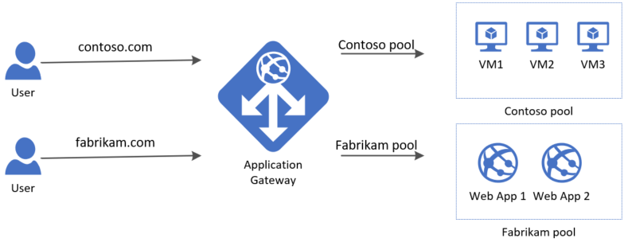

# Configure and manage virtual networks

## Configure virtual networks

- Virtual network (vNet)
  - Fundamental component of private networks
  - Enables resources to communicate securely through vNet
  - Can still configure endpoints for services that require internet communication
  - By default, outbound traffic allowed
  - By default, inbound traffic only allowed within vNet
- Quick overview
  - Logical isolation of the Azure cloud, dedicated to your subscription
  - Segment vNet into subnets
  - Control DNS server settings within vNet
  - Each vNet has its own address space
    - Specified in Classless Inter-Domain Routing (CIDR) format
    - An address space specified in CIDR format is also often referred to as a CIDR block
  - A vNet can be linked to other vNets or on-premises networks (hybrid cloud scenarios)
- Subnets
  - Logical segments within vNet
  - Each subnet contains a range of IP addresses from the vNet address space
    - Also specified in CIDR format
  - The address range of one subnet can't overlap with the range of any other subnet in the same vNet
  - For each subnet, Azure reserves 5 IP addresses
    - First address: identifies vNet address
    - Second address: configured by Azure as default gateway
    - Third and fourth: Azure maps these Azure DNS IP addresses to the virtual network space
    - Last address: broadcast address
  - Smallest supported subnet: /29
  - Largest supported subnet: /2
- Planning considerations:
  - Use and address space that's not already in use within your organization
  - Ensure non-overlapping address ranges for subnets
  - Service requirements
    - Each Azure service has different requirements for associated subnets
    - Some services require dedicated subnets, e.g. Azure VPN Gateway
    - Some services require different subnet sizes depending on scaling, e.g. App Services
  - Network virtual appliances
    - By default, all traffic allowed between subnets in a vNet
    - Possible to override this, and route traffic between subnets through a network virtual appliance
      - E.g., a VM running a firewall to only allow certain traffic
  - Service endpoints
    - Enable service endpoints in specific subnets
    - E.g., enable the service endpoint for Azure Storage in a subnet to allow access to Storage services
    - ... or don't enable service endpoints to prevent certain accesses
  - Network security groups
    - Associate an NSG to a subnet
    - Allow or deny traffic to and from sources and destinations
    - Can associate one NSG to multiple subnets
      - But only one NSG per subnet!
  - Private links
    - Provides private connectivity from a virtual network to Azure, customer-owned or Microsoft partner services
    - Configure and use private endpoints
      - Private endpoints only reachable within vNet
    - Optionally remove public endpoints entirely
    - Eliminates data expore to the public internet
- IP addresses
  - Types:
    - Private: enables communication within a vNet and on-premises network
    - Public: enables communication with the internet.

      

    - Assignment:
      - Dynamic
        - Can change over the lifespan of a resource
      - Static
        - IP address doesn't change
        - Useful for scenarios where you don't want IP to change:
          - DNS records, where a change in address would require updating the DNS record
          - Firewall rules, where a change in address would require updating the firewall rule
          - TLS/SSL certificates linked to IP address, where a change in address would require a new certificate
      - Dynamically and statically assigned IP resources can be separated into different subnets
      - Dynamic and static relevant for both private and public IPs
  - Azure Public IP address
    - Separate resource in Azure with following configuration
      - Name
      - IP version: IPv4, IPv6 or both
      - SKU: Basic or Standard
        - Basic SKU to be retired by 30 September 2025
        - Standard SKU supports zone redundance
          - Enabled by default
      - Assignment (Static or Dynamic)
        - Dynamic only available for Basic SKU, which is being retired
    - Associate with a resource:
      - Azure VM network interface card (NIC)
      - Load balancer (public IP and Load balancer SKUs must match)
      - Application gateway
      - VPN gateway

## Configure network security groups

- Network security group (NSG)
- Security rules
  - Control access within vNet
  - Create rules that allow/deny specific traffic
  - Configuration:
    - Name
    - Priority
      - Lower priority rules are applied first
        - Example: If a lower priority rule allows traffic and a higher priority rule denies traffic, it'll be allowed
    - Port (e.g. 443 for HTTPS)
    - Protocol (Any, TCP, UDP)
    - Source (Any, IP addresses, service tags...)
      - Example service tags: `Internet`, `VirtualNetwork`, `Storage`...
    - Destination (Any, IP addresses, service tags...)
    - Action (Allow or Deny)
  - Several rules created by default:
    - Inbound:
      - `AllowVNetInBound` (priority 65000)
      - `AllowAzureLoadBalancerInBound` (priority 65001)
      - `DenyAllInBound` (priority 65500)
    - Outbound:
      - `AllowVnetOutBound` (priority 65000)
      - `AllowInternetOutBound` (priority 65001)
      - `DenyAllOutBound` (priority 65500)
    - These cannot be deleted
      - However, you can override them by creating rules with lower priorities
    - Prevent resources within subnet to communicate with each other by denying all inbound and outbound traffic
- Associate NSG with one or more subnets or NICs
  - Only one NSG per subnet!
  - One or more NSGs per NIC
  - For inbound traffic, NSG security rules are first processed for subnets then NICs
  - For outbound traffic, NSG security rules are first processed for NICs then subnets
- Application security group (ASG)
  - Join one or more VMs to an ASG, then use ASG as source or destination in NSG security rules
    - Join by associating with the NIC that is attached to the VM
  - Logically group VMs by workload
    - For example, one ASG for web server VMs, another ASG for database server VMs...
  - Removes need to specify IP addresses in NSG security rules
  - Simplifies NSG security rules
    - Easier to read and understand descriptive ASG names rather than IPs
  - Don't need to rely so much on multiple subnets for logical groupings

    

## Configure Azure DNS

- Domain name system (DNS)
  - Domain name resolution (i.e. translate domain name to IP address)
  - DNS record: contains domain mappings
    - Multiple record types
    - Example record types:
      - A record: domain name to IP address mapping
      - CNAME (canonical name) record: domain name to domain name (aka. alias)
- Azure DNS allows you to manage your domain and host DNS records
- When you create an Azure AD tenant, you need to specify a `<your-domain>.onmicrosoft.com` domain.
  - `<your-domain>` must be globally unique
  - Possible to configure custom domain name, e.g. `<your-domain>.com`.
    - Must be verified owner of that domain name
      - Verify by creating a record at domain registrar (company you bought the domain name from)
      - Must be MX (Mail Exchange) or TXT (Text) record

        

    - Custom domain names must also be globally unique, so two tenants cannot use same custom domain name
- Azure DNS zones
  - Used to manage your domain
  - Hosts DNS records for a domain
  - The name of the DNS zone resource should be your domain name, e.g. `contoso.com`
  - You can have multiple DNS zones with the same name but in different resource groups
  - Each DNS zone with same name is assigned a different DNS name server address
  - The root/parent domain is registered at registrar then pointed to Azure DNS
  - Child domains are registered directly in Azure DNS by creating DNS records
- DNS delegation
  1. Identify DNS name servers
      - Automatically assigned to your DNS zone after creation
      - 4 servers are assigned
  1. Update parent domain
      - Go into the registrars DNS management tool update the NS (name server) records for all 4 assigned servers
      - Make sure to include any trailing `.`, for example: `ns1-02.azure-dns.com.`, as it indicates the end of a domain name.
  1. (Optional) Delegate subdomains
      - Delegate management of subdomains by creating separate DNS zones, e.g. `mail.contoso.com`
      - In the DNS zone for the root domain, create an NS record that maps name `mail` to the 4 DNS name servers of the DNS zone for the `mail` subdomain
- DNS records
  - Configuration
    - Name
    - Type
    - Time to live (TTL)
    - Target address (e.g. IP address or domain name)
  - Record sets: domain name mapped to set of records
    - Azure DNS manages all records as record sets
    - Most sets contain only a single record
    - Some exceptions, e.g. NS records
    - Not supported for CNAME records
- Azure Private DNS zones
  - Provides name resolution within vNet
  - No custom DNS solution required
  - Autoregistration: can automatically maintain records for VMs within vNet
    - Example:
      - You create a private DNS zone `contoso.com`
      - You link the zone to your vNet and configure autoregistration
      - You create a VM `vm1` in your vNet, it's auto registered in the zone.
      - You create a VM `vm2` in your vNet, it's auto registered in the zone.
      - `vm1` and `vm2` can now be reached within the vNet on `vm1.contoso.com` and `vm2.contoso.com` respectively
  - A single Private DNS zone can be used across multiple vNets
    - Simplifies vNet peering
  - Split-horizon DNS:
    - A private and a public DNS zone can share same name
    - Resolves to different addresses within vNet and from public internet

## Configure Azure Virtual Network peering

- Connect two vNets so resources in both vNets can communicate with each other
- Types:
  - Regional: connects two vNets in same region
  - Global: connects two vNets in separate regions
- Traffic between peered vNets is private
  - Travels through Azure backbone network, no public internet
- Low latency, high bandwidth
- Can be used to securely transfer data across Azure subscriptions
- Peering must be configured for both vNets
- Use NSGs to block or allow access to other vNets or subnets
- Configure an Azure VPN gateway
  - Send encrypted traffic over public internet
  - All peered vNets will be able to use the gateway as a transit point
  - Allows communications with resources outside the peering
  - A vNet can only contain on VPN gateway
  - Setup site-to-site VPN: connect to on-prem network
  - Setup vnet-to-vnet VPN: connect to another vNet
  - Setup point-to-site VPN: connect to a client

- Peering config (remember to configure for both vNets!):
  - Name
  - Traffic to remote virtual network
    - Allow: allow all traffic to remote networks
    - Block: block all traffic to remote networks. Use NSG security rules to open up for traffic.
  - Traffic from remote virtual network
    - Allow
    - Block
  - Virtual network gateway: specify whether your vNet peering should use a VPN gateway
- Peering status
  - Initiated: peering created, waiting for connection
  - Connected: peering connected
- Extend peering
  - Hub and spoke network
    - Hub network hosts a network virtual appliance (NVA) or an Azure VPN Gateway
  - User-defined routes (UDRs)
  - Service chaining

## Configure network routing and endpoints

- Use network routes to control flow through network
  - A route specifies how packets should be routed in a vNet
  - Routes are stored in a route table
  - Packets are matched to routes by destination
  - Next hop types:
    - Virtual network gateway
    - Virtual network
    - Internet
    - VNA (requires specifyng the IP address of the VNA, e.g. a VM)
    - None (drops the packet)
  - If a matching route cannot be found, the packet is dropped
- Azure uses system routes to direct network traffic between VMs, on-prem networks and the internet
  - Azure automatically creates and associates a route table for each subnet
  - Azure automatically creates system routes
    - System routes control traffic...
      - ... between VMs in same subnet
      - ... between VM in different subnets in same vNet
      - ... from VMs to the internet
    - Information about system routes are recorded in a route table
    - You cannot create or remove these
    - Can be overriden by custom routes
- User-defined routes (UDRs)
  - Control network traffic by defining routes that specify the next hop of the traffic flow
  - Next hop can be:
    - vNet gateway
    - vNet
    - Internet
    - NVA
  - Creating UDRs:
    - Create a route table
    - Associate the route table with a subnet
      - A subnet can only be associated with one table!
      - A route table can be associated with multiple subnets
- Service endpoints
  - Enable service endpoints to allow private traffic to Azure services (Key Vault, Storage, SQL...)
    - Configure service endpoints through subnet
    - Add virtual network rules to resources
  - Traffic travels directly from your vNet to the service on the Azure backbone network
    - Never enters public internet
  - Can still use firewall rules to open for access from given public IP addresses
- Azure Private Link
  - Provides private connectivity from vNet to Azure, customer-owned or Microsoft partner services
  - Secures connection between endpoints
    - Eliminates data exposure to public internet

## Configure Azure Load Balancer

- Frontend --> Azure Load Balancer --> Backend pool (e.g. multiple VMs)
  - Balances traffic to VMs in backend pool based on load balancing rules and health probes
- Can be used for both frontend and backend scenarios
- Things to know:
  - Use for inbound or outbound scenarios
  - Can implement public or internal load balancer, or use both types in combination
    - Public: share load of incoming web traffic
    - Internal: share load of traffic inside virtual network

    

  - Frontend configuration specifies public or internal IP that your load balancer responds to
  - Backend pool contains Azure resources, such as Azure VMs or instances in an Azure VM Scale Set
  - Load balancing rules determine how traffic is distributed to backend resources
    - By default, uses a five-tuple (source IP, source port, destination IP, destination port, and protocol type) hash to map traffic to available servers.
  - Health probes ensure the resources in the backend are healthy
- SKUs
  - Basic
    - New Load Balancers should use Standard
    - Can upgrade old Load Balancers from Basic to Standard
    - HTTP and TCP health probes
    - Multiple frontends (inbound only)
    - Open by default (optional: control through NSG)
  - Standard
    - Offers expanded and more granular feature set over Basic
    - HTTP, HTTPS and TCP health probes
    - Zone-redundant
    - Zonal frontends
    - Multiple frontents (both inbound and outbound)
    - Closed to inbound flows unless allowed by an NSG
      - Internal traffic from vNet to internal load balancer is allowed
  - Gateway
    - Supports high performance and high availability scenarios with third-party NVAs
- Backend pools
  - Can configure one or more backend pools
    - Basic: up to 300
    - Standard: up to 1000
  - Connect to availability sets, VMs or VM Scale Sets
  - Basic SKU: select VMs in single availability set or VMs in a single VM Scale Set
  - Standard SKU: select VMs or VM Scale Sets in a single vNet
    - Configuration can include a combination of VMs, availability sets and VM scale sets
- Health probes
  - Monitors the status of your applicaiton
  - Dynamically adds or removes VMs from Load Balancer based on their response to health checks
    - If a probe fails to respond, the load balancer stops sending new connections to the unhealthy instance
  - Configuration:
    - Name
    - Protocol: HTTP , HTTPS or TCP
      - HTTP and HTTPS
        - if response is HTTP 200 message from specified URI, instance is healthy
      - TCP: relies on establishing successful TCp session to a defined port
        - if an ACK is received, instance is healthy
    - Port: port on which the probe queries the backend
    - (HTTP and HTTPS only) URI: URI for requesting health status from backend
    - Interval: amount of time between prope attempts in seconds (default 15)
    - Unhealthy threshold: number of failures before instance considered unhealthy
- Load Balancer rules
  - Create LB rules to specify how traffic is distributed
  - Each rule maps a front-end IP address and port combination to a set of backend IP address and port combinations
  - Creating LB rules required frontend, backend and health probe
  - Config:
    - IP version (IPv4 or 6)
    - Frontend IP address
    - Protocol (TCP or UDP)
    - Port
    - Backend pool
    - Backend port
    - Health probe
    - Session persistence
      - None (default): any VM can handle any requests
      - Client IP: consecutive requests by same client ID will be routed to same VM
      - Client IP and protocol: consecutive requests by same client IP address and protocol will be routed to same VM

## Configure Azure Application Gateway

- Load balancer for web traffic
- Listens to messages over HTTP/HTTPS
- Gateway rules direct the traffic to resources in a backend pool
  - Backend pool can include:
    - Azure VMs
    - Azure VM scale sets
    - Azure App Services
    - On-premises servers
- Highlighted features:
  - Application layer routing (top layer 7 in the 7-layer OSI Model of the Internet)
    - Direct traffic based on the URL of a request.
  - Round-robin load balancing
    - Client requests are forwarded in a cycle through a group of servers
    - Creates an effective balance for the server load
  - Session stickiness
    - Ensure client requests in the same session are routed to the same backend server
  - Supported protocols
    - HTTP
    - HTTPS
    - HTTP/2
    - WebSocket
      - Bidirectional protocol (HTTP/HTTPS is unidirectional)
  - Firewall protection
    - Implement web application firewall (WAF)
    - Protect against common exploits and vulnerabilites
    - Create policy
      - Select from managed rules (Azure-managed pre-configured rules)
        - Protects against SQL injection, cross-site scripting, remote file inclusion...
      - Create custom rules
  - End-to-end (E2E) encryption
  - Load autoscaling
    - Dynamically adjust capacity as web traffic load changes
- Application Gateway routing
  - Client sends request to your application by specifying the IP address or domain name of your App Gateway
  - App Gateway routes traffic to web servers in backend pool based on defined set of rules
  - Two primary routing methods:
    - Path-based routing: sends requests with different URL **paths** to different backend pools

      

    - Multi-site routing: sends requests with different URLs to different backend pools
      - Allows configuration of more than one web application on the same App Gateway instance
      - Configure multiple CNAMEs for the IP address of the App Gateway
      - The App Gateway routes the traffic to the correct backend pool based on URL

      

  - Redirect traffic
    - Redirect traffic from one listener to another
    - Commonly used approach to redirect HTTP requests to communicate via HTTPs
  - Rewrite HTTP headers
    - E.g. rewrite `Location` header from `https://*.azurewebsites.net` to `https://*.contoso.com`
  - Configure custom error pages
    - Configure own brancing and layout
- App Gateway components
  - Frontend IP address: receives client requests
    - You can only have one public and one private IP address
  - (Optional) Firewall: checks incoming traffic for common threats before it reaches the listeners
  - Listeners: receive traffic and route requests to backend pool
    - You can have one or more listeners
    - Accept traffic on a specified combination of...
      - Protocol
      - Port
      - Hostname
      - IP address
    - Each listener routes requests to a bacend pool according to a routing rule
    - Listener types:
      - Basic listener: enables path-based routing rules
      - Multi-site listener: enables multi-site routing rules
  - Routing rules: defines how to analyze the request to direct it to appropriate backend pool
    - Binds your listeners to your backend pools
  - Backend pool: contains web servers (e.g. a VM, VM scale set or an App Service)
    - Each pool has a load balancer to distribute the workload across the resources
  - Health probes: determine which backend pool servers are available for load balancing

  

## Design an IP addressing schema for your Azure deployment

- Public IP addresses
  - Used by outbound public internet traffic as source
  - Used by inbound public internet traffic as destination
- Private IP addresses
  - Designed for private networks and won't we sent over internet routers
  - Non-routable private IP ranges:
    - Class A: 10.0.0.0/8 (10.0.0.0 - 10.255.255.255)
    - Class B: 172.16.0.0/12 (172.16.0.0 - 172.31.255.255)
    - Class C: 192.168.0.0/16 (192.168.0.0 - 192.168.255.255)
- Azure vNets use private IP addresses
- Azure Public IP addresses can be assigned to:
  - VM network interface cards (NICs)
  - Load balancers
  - Application gateways
- Azure Public IP address prefix
  - A reserved continuous range of public IP addresses
- Typical Azure network design:
  - vNets
  - Subnets
  - NSGs
  - Firewalls
  - Load balancers

  

- Azure networking allows scaling on demand
- Entire infrastructure is virtual
- Ensure there is no IP address overlap for interconnected networks (cloud or on-prem)
- Ensure these is no IP address overlap for subnets within a vNet
- Plan IP addressing for your networks:
  - How many devices will be on the network?
  - How many devices will be added to the network in the future?
  - Based on the services running on the infrastructure, which devices need to be separated?
    - Provides isolation, increasing security
    - Demilitarized zones (DMZs)
  - How many subnets are needed?
  - What sizes do the subnets need to be?
  - How many subnets will be added in the future?

## Distribute your services across Azure virtual networks and integrate them by using virtual network peering

## Host your domain on Azure DNS

## Manage and control traffic flow in your Azure deployment with routes

## Improve application scalability and resiliency by using Azure Load Balancer
