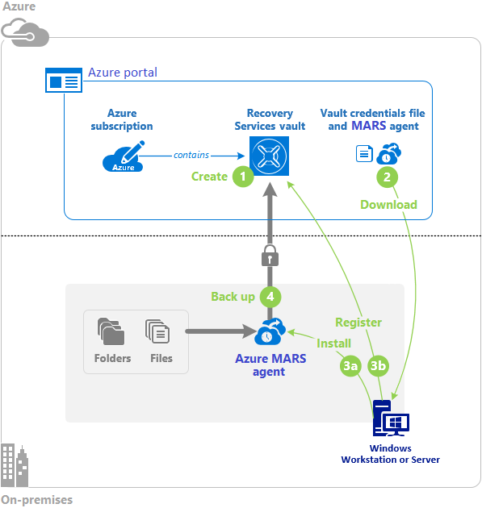

# Monitor and back up Azure resources

## Configure file and folder backups

- Azure Backup service
- Highlighted features:
  - Backup on-premises resources to the cloud
  - Backup Azure VMs
  - Backup Azure Files, Blobs, managed disks
  - Backup Azure Database for PostgreSQL server
  - Backups stored in Azure Recovery Services vault
  - Configure backup policies that define frequency, retention...
  - Unlimited and no cost inbound/outbound data transfer during restore operations
  - Encrypt backups with locally stored passphrase
  - Get app-consistent backups
    - No extra fixes required for the backups to work
  - Retain short- and long-term data
    - No limit on retention
    - Limit of 9,999 recovery points per instance
  - Storage replication options
    - LRS
    - ZRS
    - GRS
  - Soft delete
- Backup center
  - Unified management experience for Azure Backup
  - Govern, monitor, operate and analyze backups
- Recovery Services vault
  - Automatically manages Storage for you
  - You only need to specify replication
- Microsoft Azure Recovery Services (MARS) agent
  - Backs up on-prem resource or Azure VM to Azure Backup
  - Agent runs on the machine to be backed up.
- Configure on-prem backup:

  

## Configure virtual machine backups

- Backup options for VMs:
  - Azure Backup
    - Takes snapshot of VM and stores data as recovery points in geo-redundant Azure Recovery Services vault
    - Restore entire VM or specific files
  - Azure Site Recovery
    - Replicates VMs to secondary region
    - Protects VMs from major disaster scenario where entire region experiences an outage
  - Azure managed disk - snapshot
    - Read-only full copy of a managed disk
    - Each snapshot is stored independent of the source disk and can be used to create new identical managed disks
    - Billed for actual size of snapshot
      - If 10/64 GB used, you're only billed for the 10 GB used, not the 64 GB available
  - Azure managed disks - image
    - Capture single image that contains all managed disks associated with a VM
    - Including both OS and data disks
- Back up your VMs:
  1. Create a Recovery Services vault
      - Specify region
      - Specify storage replication
  1. Define your backup policy options
      - Define when to take snapshots (frequency)
      - Define how long to store snapshots (retention)
  1. Back up your virtual machine
      - Install and configure MARS on VM
      - If VM was created from Azure gallery, MARS should already be installed
- Other options for VM backups:
  - System Center Data Protection Manager (DPM)
  - Microsoft Azure Backup Server (MABS)
  - Back up VMs to DPM or MABS storage, then back up the DPM or MABS storage to an Azure Recovery Services vault
  - To backup on-prem machines, DPM or MABS **instance** must run on-prem
  - To backup Azure VMs, DPM or MABS **instance** must be run on an Azure VM
  - DPM or MABS **protection agent** must be installed on each machine (on-prem or cloud) to be backed up
  - DPM and MAPS provider more granular scheduling options
- Soft-delete for Azure VM backups
  - Deleted backup data is retained for a given number of days (default: 14)
  - Prevents accidental loss of backup data

## Configure Azure Monitor

- Collect, analyze and respond to telemetry data
- Azure Monitor data types:
  - Metrics
    - For example consumption (CPU, memory and storage usage)
  - Logs
    - For example read, write and delete operations (audit logs)
    - Stored in Log Analytics
    - Use Kusto Query Language (KQL) to query logs from Log Analytics
- Monitoring data tiers:
  - Tenant
    - Operation of tenant-level Azure services, such as Aure AD
  - Subscription
    - Operation and management logs of Azure subscription (activity log)
  - Resource
    - Operation logs and metrics of Azure resources
  - Application
    - Performance and functionality of application code
- Activity logs
  - Subscription level logs
  - Categories:
    - Administrative: who created, updated and/or deleted resources?
    - Service Health: downtime and maintenance status
    - Resource health: resource availability
    - Alert
    - Autoscale
    - Recommendations: how to better utilize resources
    - Security: alerts generated my Microsoft Defender for Cloud
    - Policy: all operations performed by Azure Policy
  - 90 day retention by default (can be changed)
  - Filters:
    - Subscription(s)
    - Timespan
    - Event severity level(s) (informational, warning, error, critical)
    - Resource group(s)
    - Resource(s)
    - Resource type(s)
    - Operation(s)
    - Event initiated by

## Configure Azure alerts

- Configure Azure alerts to react and send notifications based on telemetry data
- Helps detect and address issues
- Prevent disruption and downtime
- Configure Azure Monitor to capture telemetry data
- Create alerts based on captured telemetry data
- An alert consists of alert rules that combine the settings and conditions you want to monitor, including:
  - Resources to monitor
  - Signals or telemetry to gather from the resources
  - Conditions to match
- If an alert rule monitors multiple resources, it triggers separately for each resource
- When an alert triggers, it sends a notification based on a configured action group
- Action group defines receivers, including:
  - Azure roles
  - Email
  - SMS
  - Webhook (Slack, Teams...)

  

- Common alert types:
  - Metric alerts: evaluate resource metrics data at regular intervals
  - Log alerts: evaluate resource logs at a predefined frequency
  - Activity log alerts: trigger when a new activity log event occurs (e.g. when a resource is deleted)
  - Smart detection alerts: trigger on potential performance issues and failure anomalies in your web app using Application Insights
- Alert states:
  - When the conditions of an alert rule are met, an alert triggers and invokes specified action group
    - Default alert state is `New`
    - This state is set automatically by Azure
    - This is the only state that is set automatically
  - When the issue that caused the alert is in review, you can change state to `Acknowledged`
  - Once issue has been resolved (or ignored), you can change state to `Closed`
  - Possible to "repoen" alert by changing state back to `New` or `Acknowledged`
- Azure Monitor conditions:
  - When an alert triggers, the Azure Monitor condition for that alert is `Fired`
  - When the alert is closed, the Azure Monitor condition is `Resolved`
- Stateless vs stateful alerts
  - Stateless alerts trigger each time your alert rule condition matches your data, even if same alert already exists
    - Activity logs are always stateless
  - Stateful alerts trigger when your alert rule condition matches your data, and the alert does not already exist
- Create alert rule:
  - Resource
  - Condition
    - Alert signal
      - Metric
      - Log
      - Activity log
      - Application Insights
    - Rule criteria
      - E.g. `CPU percentage greater than 70%`
  - Actions
  - Alert details
    - Name
    - Description
    - Issue severity
      - 0-4, where 0 is highest severity:
        - 0: critical
        - 1: error
        - 2: warning
        - 3: informational
        - 4: verbose
- Action groups
  - Defines receivers that should be notified of alerts:
    - Email
    - SMS
    - Azure role
  - Can also define actions:
    - Trigger Azure Function
    - Trigger Azure Automation runbook
    - Trigger webhook
  - A single action group can be reused across alerts
  - Alert processing rules
    - Process alerts before a notification is sent
      - Suppress notifications during planned maintenance
      - Implement common logic in single processing rule instead of all alert rules

## Configure Log Analytics

- Log Analytics workspace
  - Log storage and management for Azure Monitor
  - Logs are stored in tables by category
  - Query logs from tables using Kusto Query Language (KQL)
    - Similar to SQL
- KQL
  - Common operators:
    - `where`: filter by column
    - `project`: select columns
    - `extend`: add additional column
    - `summarize`: aggregate results (useful functions here are `count` and `avg`)
    - `render`: visualize results (e.g. table, timechart, piechart)
  - Use pipe `|` to combine operations
  - Exampel query:

    ```kql
    StormEvents
    | where State == 'TEXAS' and EventType == 'Flood'
    | project StartTime, EndTime, State, EventType, DamageProperty
    ```

- For VMs, install the Log Analytics agent and configure it to send logs to Log Analytics.

## Configure Network Watcher

- Azure Network Watcher
- Troubleshoot virtual networking
- Features:
  - IP flow verify
    - Diagnose connectivity to/from internet or on-prem
    - Helps identify if a security rule is blocking traffic
    - You must specify:
      - Subscription and resource group
      - VM and NIC
      - Local source IP address and port number
      - Remote destination IP address and port number
      - Protocol (TCP or UDP)
      - Traffic direction (inbound or outbound)
    - Returns:
      - Name of security rule that allows or blocks traffic
  - Next hop
    - View next hop in network route
    - Verify that traffic is directed to intended destination
    - You must specify:
      - Subscription and resource group
      - VM and NIC
      - Source IP address
      - Destination IP address
    - Returns:
      - Next hop type
        - Internet
        - VirtualAppliance
        - VirtualNetworkGateway
        - VirtualNetwork
        - VirtualNetworkPeering
        - VirtualNetworkServiceEndpoint
        - MicrosoftEdge
        - None
      - IP address of next hop (if available)
      - Route table for the next hop (if available)
  - VPN troubleshoot
    - Troubleshoot vNet gateway
  - NSG diagnostics
    - Map IP traffic through an NSG
  - Connection troubleshoot
    - Check a direct TCP or ICMP connection from one resource to another or to a FQDN, URI or IPv4 address
- Network Watcher Topology tool
  - Helps visualize network topology

  

## Improve incident response with alerting on Azure

- Metric alerts
  - Alert on metric conditions
  - E.g. alert on CPU usage of VM
  - Metric types:
    - Static:
      - Based on simple static conditions and thresholds
      - Configuration:
        - Threshold (e.g CPU usage > 80%)
        - Check every: X minute(s)
        - Lookback period: Y minute(s)
    - Dynamic:
      - Uses machine learning to continuously learn the metric behaviour and patters
      - Calculates the appropriate thresholds for unexpected behaviour
- Log alerts
  - E.g. alert when number of HTTP response 403 (forbidden) reaches given threshold
- Activity log alerts
  - E.g. alert when someone creates a VM

## Analyze your Azure infrastructure by using Azure Monitor logs

(None)

## Monitor performance of virtual machines by using Azure Monitor VM Insights
